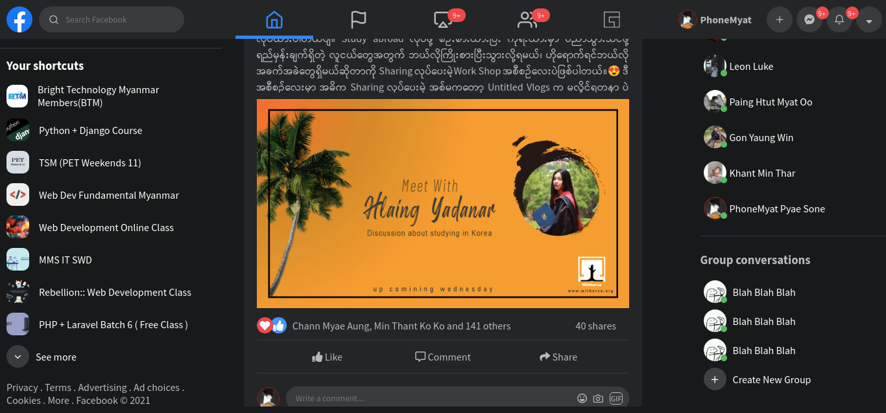

# Facebook-UI-Clone With HTML and CSS

ကျွန်တော် Web Design ကိုလေ့လာရင်း သင်တန်းက project ကိုလိုက်လုပ်ထားတာဖြစ်ပါတယ်။ အဓိကအနေနဲ့ကတော့ HTML နဲ့ CSS ပဲသုံးထားတာဖြစ်ပါတယ်။ UI သီးသန့်ပဲဖြစ်ပါတယ်။ CSS မှာဆိုရင်တော့ Flex Box ကို အဓိက အသုံးပြုထားတာဖြစ်ပါတယ်။
Icon အတွက်ကတော့ fontawesome,feather icon နဲ့ icon8 တို့ကို အသုံးပြုထားပါတယ်။ font အတွက်ကတော့ google fonts ကိုပဲ သုံးထားတာဖြစ်ပါတယ်။

## Project Screenshots

  
